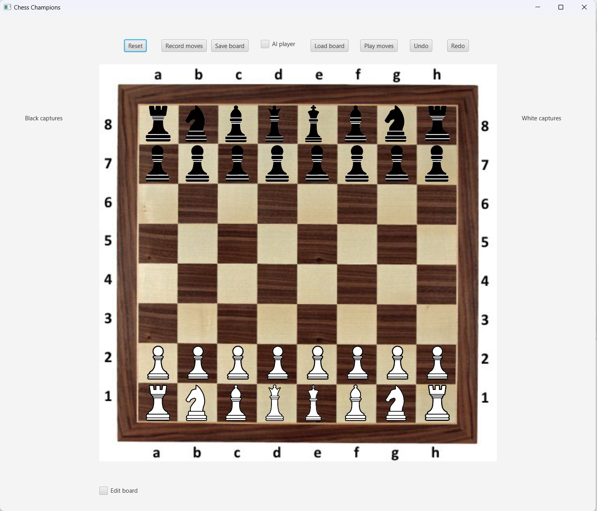

# Chess Champions

## Description

This is a simple chess game developed using Java and JavaFX. It provides a user-friendly interface for playing chess with basic functionalities.

## Prerequisites

- [Eclipse IDE](https://www.eclipse.org/downloads/)
- Java Development Kit (JDK) installed on your machine
- JavaFX library configured in your Eclipse project

## Installation

1. **Clone the Repository:**

   ```bash
   git clone https://github.com/ali-sultani/Chess-Champions.git

2. **Open Project in Eclipse:**

- Open Eclipse IDE.
- Select File -> Open Projects from File System.
- Browse and select the cloned repository directory.

3. **Configure JavaFX:**

- Right-click on your project in Eclipse and select Build Path -> Configure Build Path.
- In the Libraries tab, click on Modulepath and add the JavaFX library.

## Running the Game

1. **Set the Main Class:**

- Right-click on your main class (the one with the main method) in Eclipse.
- Select Run As -> Run Configurations.
- In the Main tab, specify the main class (e.g., chess.ui.GameView).

2. **Configure JavaFX VM Arguments:**

- In the same Run Configurations window, go to the Arguments tab.

- Add the following VM argument:

    ```bash
    --module-path /path/to/javafx-sdk-16/lib --add-modules javafx.controls,javafx.fxml

    Replace /path/to/javafx-sdk-16 with the actual path to your JavaFX SDK.

3. **Run the Application:**

- Click Apply and then Run.

## Gameplay
- The game window should open, displaying the chessboard.
- Use the mouse to click on pieces and make moves.
- Enjoy playing chess!



## Additional Notes
This chess game is a basic implementation and may lack advanced features.
Feel free to customize and extend the code according to your preferences.
